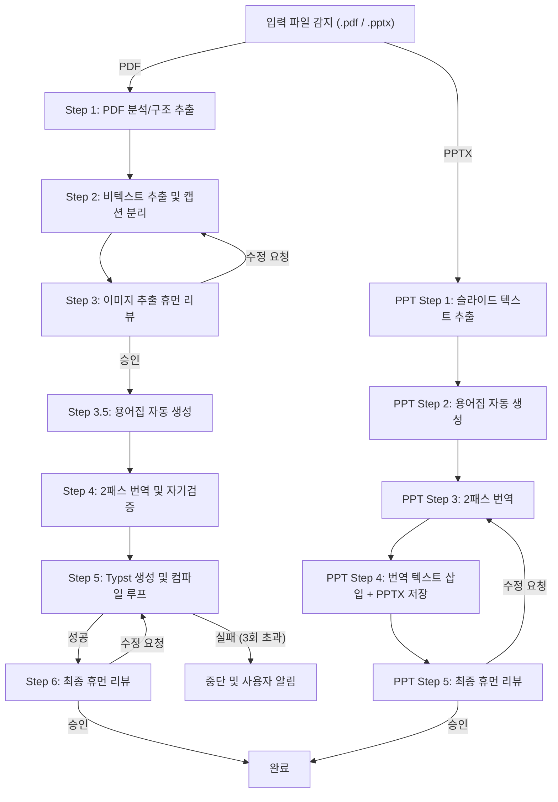

# 에이전트 시스템 설계서: 학술 자료 자동 번역 시스템 (V5)

## 1. 작업 컨텍스트 문서

* **배경 및 목적**: 영문 학술 자료(논문 PDF, 발표자료 PPTX)를 한국어로 번역한다. PDF는 Typst를 활용해 원문의 레이아웃을 충실히 재현한 한국어 PDF로 자동 재조판하고, PPTX는 원본 레이아웃·서식을 유지한 채 텍스트만 한국어로 교체한다. 개인 학습 목적으로 사용하며, 속도보다 번역의 자연스러움을 우선한다.
* **실행 환경**: **Cursor IDE (Agent/Composer)** 내부에서 네이티브로 실행. Cursor의 규칙(`.cursor/rules`) 및 스킬 체계를 활용한다.
* **대상 OS**: Windows (크로스 플랫폼 지원 불필요)
* **대상 자료**: 다양한 분야(CS, 의학, 물리 등)의 학술 논문(PDF) 및 발표자료(PPTX)
* **입력**: 영문 원본 파일 (`.pdf` 또는 `.pptx`) — 한 번에 한 편씩 처리
* **출력**: 
  * **(PDF)** 최종 한국어 번역본 (`.pdf` — Typst 컴파일 결과물), Typst 소스 코드 파일 (`.typ`) 및 추출된 비텍스트 에셋 폴더
  * **(PPTX)** 최종 한국어 번역본 (`.pptx` — 원본 레이아웃 유지, 텍스트만 교체)
  * 자료별 용어집 (`.json`) — 자동 생성
* **핵심 설계 원칙 (LLM vs 스크립트 분리)**:
  * **코드/스크립트**: 파일 I/O, PDF 파싱 및 크롭, PPTX 텍스트 추출/삽입, CLI 명령어 실행 등 **결정론적이고 기계적인 작업**을 전담. 표, 블록 수식, 알고리즘/의사코드는 철저히 이미지로만 취급한다(PDF).
  * **에이전트(LLM)**: 번역, 문맥 기반 레이아웃 해석, 에러 로그 분석 후 코드 수정 등 **비정형 데이터 생성 및 추론**을 전담. Cursor 내장 모델을 사용한다.

---

## 2. 워크플로우 정의

### [전체 흐름도 — 입력 형식 분기]



### [PDF 파이프라인 — 단계별 상세 정의]

#### Step 1: PDF 분석 및 구조 추출

* **스크립트 처리 (코드)**: 
  * **추천 도구: PyMuPDF + GROBID 하이브리드 접근**
    * **GROBID** (서버 기반 학술 논문 전용 파서): 논문의 논리적 구조(제목, 초록, 섹션, 참고문헌 등)를 XML/TEI로 추출. 다양한 분야와 레이아웃에 강건하다. Docker로 로컬 실행 가능.
    * **PyMuPDF** (좌표 기반 파서): GROBID가 식별한 구조를 기반으로 정확한 좌표를 매핑하고, 비텍스트 영역(그림, 표, 수식)의 바운딩 박스를 추출하며 이미지 크롭을 수행한다.
  * **GROBID 사용이 어려운 경우의 대안**: PyMuPDF 단독 사용 + 폰트 크기/굵기 기반 섹션 감지 + LLM 검증 하이브리드 방식
* **에이전트 처리 (LLM)**: GROBID/스크립트가 추출한 구조 데이터를 검증하고, 불명확한 경계(예: 서론과 관련 연구의 경계, 부록 시작점)를 문맥으로 보정한다.

##### [2단 레이아웃 엣지케이스 처리 전략]

| 엣지케이스 | 처리 방식 |
|---|---|
| **컬럼 텍스트가 다음 페이지로 이어지는 경우** | PyMuPDF의 좌표 기반 읽기 순서 정렬 (좌상→우하, 컬럼별) + GROBID의 논리적 흐름 정보로 교차 검증 |
| **그림/표가 두 컬럼을 걸쳐 배치된 경우** | 바운딩 박스 너비가 페이지 폭의 60% 이상이면 full-width 요소로 분류. 해당 영역을 별도 크롭 |
| **각주(푸터)가 페이지 하단에 있는 경우** | 페이지 하단 10% 영역의 작은 폰트 텍스트를 각주로 식별. 각주는 해당 섹션 번역 시 별도 블록으로 처리하되, 원문 유지 또는 번역 여부는 에이전트가 문맥으로 판단 |
| **타이틀 영역이 비정형인 경우** | GROBID가 타이틀/저자를 자동 식별. 실패 시 첫 페이지 상단 30%를 에이전트에 전달하여 수동 판단 |

#### Step 2: 비텍스트 요소 추출 및 캡션 분리

* **스크립트 처리**: Step 1의 좌표를 바탕으로 그림(Figure), **표(Table), 블록 수식(Block Equation), 알고리즘/의사코드(Algorithm) 영역을 텍스트 추출 없이 무조건 이미지로 크롭(Crop)**하여 저장한다. 해당 요소들의 상/하단 캡션 텍스트만 별도로 분리하여 메타데이터(`assets_manifest.json`)로 저장한다.
* **에이전트 처리**: 크롭된 이미지가 표인지 그림인지 알고리즘인지, 캡션이 어디까지인지 불분명한 엣지 케이스 발생 시 문맥을 분석해 분류한다.

#### Step 3: 이미지 추출 휴먼 리뷰

* **흐름**: Cursor 터미널에 리뷰 요청 메시지 출력 후 **에이전트 실행 일시 정지**. 사용자에게 확인할 항목 체크리스트 표시.
* **사용자 행동**: `/output/assets` 폴더를 직접 열어 표/그림/블록 수식/알고리즘 이미지와 분리된 캡션 확인. Cursor Chat에서 피드백 입력:
  * **승인**: "OK" 또는 "승인" 입력 → 다음 단계 진행
  * **수정 요청**: "Figure 3 잘림", "Table 2 누락" 등 구체적 피드백 → 해당 영역 재추출
* **체크리스트 출력 예시**:
  ```
  [이미지 추출 리뷰]
  - 총 추출 에셋: Figure 5개, Table 3개, Equation 2개, Algorithm 1개
  - 출력 경로: ./output/assets/
  - 확인 사항: 잘림, 누락, 잘못된 분류가 없는지 확인해 주세요.
  - 승인: "OK" 입력 / 수정: 구체적 피드백 입력
  ```

#### Step 3.5: 용어집 자동 생성 (신규 단계)

* **에이전트 처리**: 이미지 리뷰 승인 후, 본문 텍스트에서 핵심 전문 용어를 추출하여 **논문별 용어집**을 자동 생성한다.
* **용어집 구조** (`glossary.json`):
  ```json
  {
    "transformer": { "ko": "트랜스포머", "context": "모델 아키텍처" },
    "attention mechanism": { "ko": "어텐션 메커니즘", "context": "핵심 기법" },
    "fine-tuning": { "ko": "미세 조정", "context": "학습 기법" }
  }
  ```
* **목적**: 이후 병렬 번역 시 모든 섹션에 동일한 용어집을 컨텍스트로 제공하여 용어 일관성을 보장한다.

#### Step 4: 번역 및 자기 검증 (LLM 핵심 판단 영역)

##### [병렬 번역 단위]
* **섹션(논리적 구획) 단위 병렬 번역**: GROBID/LLM이 식별한 논리적 섹션(Introduction, Methods, Results 등)을 기준으로 병렬 처리한다.

##### [컨텍스트 제공 전략 — 추천 구성]
각 섹션 번역 시 다음 컨텍스트를 프롬프트에 포함:
1. **논문 초록(Abstract)**: 전체 논문의 맥락 파악용 (모든 섹션에 공통 제공)
2. **용어집(glossary.json)**: Step 3.5에서 생성된 용어집 전체 (용어 일관성 보장)
3. **이전 섹션의 번역 결과 요약** (선택적): 섹션 간 문맥 연결이 중요한 경우, 직전 섹션의 마지막 2-3문장을 참조 컨텍스트로 제공. 단, 완전한 병렬 처리를 위해 초록+용어집만으로도 충분한 경우가 대부분이므로, 이전 섹션 컨텍스트는 2패스 윤문 단계에서 자연스럽게 보정한다.

##### [2패스 번역 전략 — 추천 방식]
번역투를 최소화하기 위해 **2패스 번역**을 기본으로 한다:

| 패스 | 역할 | 핵심 지시사항 |
|---|---|---|
| **1패스: 초벌 번역** | 원문의 의미를 정확히 전달하는 직역에 가까운 번역 | 누락 없이 모든 내용 포함, 용어집 준수, 수식 보존 |
| **2패스: 윤문(자연스러움 교정)** | 1패스 결과를 한국어 학술 문체로 다듬기 | 영어 어순 직역 제거, 불필요한 수동태→능동태 전환, 과도한 대명사('그것은', '이것을') 자연스러운 한국어로 대체, 관계대명사절 분리/재구성 |

* **에이전트 처리 (1패스 — 병렬 번역)**: 추출된 텍스트와 캡션을 섹션별 병렬로 번역한다.
  * **[번역 8대 원칙 (Translation Guidelines)]**
    1. **톤앤매너**: 학술 논문체 유지 (경어체 "~한다/~이다" 논문 서술체, 전문 용어 활용).
    2. **용어 병기**: 고유명사 및 약어는 첫 등장 시에만 "한국어(영어)" 병기. 용어집 준수.
    3. **제외 영역 (섹션)**: 참고문헌(References) 섹션은 번역하지 않고 원문 텍스트 그대로 유지.
    4. **캡션 번역**: 캡션의 접두어(Figure X, Table X)를 포함하여 한국어로 번역.
    5. **표 내부 텍스트 제외**: 표는 이미지로 처리되었으므로, 프롬프트에 섞여 들어온 표 내부로 추정되는 파편화된 텍스트는 번역하지 않고 무시/삭제한다.
    6. **수식 보존**: 문장 내에 포함된 **인라인 수식(예: `$E=mc^2$`)은 절대 별도로 번역하거나 변환하지 않고, 마크업 문법 그대로 텍스트와 함께 유지**한다. (블록 수식은 Step 2에서 이미 이미지로 처리됨)
    7. **제목 처리**: 논문 제목은 한국어로 번역하고 원문을 괄호 안에 병기한다. 저자명은 원문 그대로 유지한다.
    8. **초록 번역**: Abstract는 본문과 동일한 원칙으로 번역한다.

* **에이전트 처리 (2패스 — 윤문)**: 1패스 번역 결과를 섹션 순서대로 순차 윤문한다. 이때 이전 섹션의 윤문 결과를 참조하여 문맥적 연결성을 강화한다.
  * **윤문 시 중점 교정 항목**:
    * 영어 어순을 그대로 따른 직역체 → 한국어 자연어순으로 재배치
    * "~되어진다", "~에 의해" 등 불필요한 수동태 → 능동태 전환
    * "그것은", "이것을", "그러한" 등 과도한 대명사 → 구체적 명사로 대체 또는 생략
    * 영어식 관계대명사절 ("~하는 것은 ~한 것이다") → 짧은 문장으로 분리

##### [자기 검증 — 추천 구성]
번역(2패스) 완료 후 다음 항목을 자동 검증한다:

| 검증 항목 | 방법 | 실패 시 처리 |
|---|---|---|
| **문단 누락 체크** | 원문과 번역문의 문단 수 비교 | 해당 섹션 재번역 |
| **수식 기호 훼손 여부** | 원문의 `$...$` 패턴과 번역문 비교 | 수식 부분만 원문에서 복원 |
| **용어 일관성 체크** | glossary.json 대비 번역문의 용어 사용 검증 | 불일치 용어 교체 |
| **길이 비율 체크** | 원문 대비 번역문 글자 수 비율 (한국어는 보통 영어의 0.7~1.2배) | 비율 이상 시 누락/중복 의심 → 해당 섹션 재검증 |
| **구조적 대응 검증** | 원문과 번역문의 섹션/문단 구조 1:1 대응 확인 | 구조 불일치 시 재정렬 |

#### Step 5: Typst 소스 생성 및 컴파일 (에러 복구 루프)

##### [인라인 수식 변환 전략 — 추천 방식]
PDF에서 추출된 텍스트의 인라인 수식은 유니코드 문자(α, Σ 등)로 나오는 경우가 많다. Typst 마크업으로 변환하기 위해 **하이브리드 접근**을 사용한다:

1. **스크립트 전처리**: PyMuPDF의 폰트 정보(수학 전용 폰트: CMMI, CMSY, Symbol 등)를 기반으로 수식 영역을 자동 식별하고, 유니코드 → Typst 수식 마크업 매핑 테이블로 기본 변환 수행
2. **에이전트 후처리**: 스크립트가 처리하지 못한 복잡한 수식 표현(분수, 첨자 조합 등)을 문맥 기반으로 Typst 문법에 맞게 교정

##### [레이아웃 재현 전략]
* **목표**: 원문과 거의 동일한 레이아웃 재현 (단 수준, 여백, 이미지/표 위치)
* **그림/표 위치**: 원문의 대략적 위치를 유지하되, 한글 번역으로 텍스트 길이가 변하므로 **±1~2 페이지 차이는 허용**한다. Typst의 `figure(placement: auto)` 등을 활용.
* **헤더/푸터**: 원문의 저널명, 페이지 번호 등 헤더/푸터는 **제거**한다. 번역본에는 페이지 내용만 포함.
* **AI 번역 워터마크**: 삽입하지 않는다.

##### [한글 폰트 설정 — 추천 구성]

| 용도 | 추천 폰트 | 이유 |
|---|---|---|
| **본문** | Pretendard 또는 KoPubWorld돋움 | 가독성 우수, 학술 문서에 적합한 깔끔한 고딕체. Pretendard는 웨이트가 다양하고 무료 |
| **제목** | Pretendard Bold (또는 KoPubWorld돋움 Bold) | 본문과 통일된 서체 계열 |
| **수식 혼합 영역** | 본문 폰트 + Typst 기본 수식 폰트(New Computer Modern Math) | Typst가 수식 폰트를 자동 처리하므로 CJK 충돌 최소화 |

* **줄간격**: 한글 학술 논문 관행상 본문 `1.5em`~`1.6em` 권장
* **Typst CJK 설정**: `#set text(font: ("Pretendard", "New Computer Modern"), lang: "ko")` — Typst 0.11+에서 CJK 지원이 안정화됨

##### [컴파일 및 에러 복구]
* **에이전트 처리 (생성)**: 번역된 텍스트, 보존된 인라인 수식 마크업, 추출된 이미지(표, 그림, 블록 수식, 알고리즘) 경로를 조합하여 **Typst 마크업 소스 코드(`.typ`)**를 생성한다.
* **스크립트 처리 (실행)**: 생성된 소스를 `typst compile` 명령어로 컴파일.
* **실패 시 처리 (LLM 에러 복구)**: 스크립트가 반환한 에러 로그(stderr)를 에이전트가 분석하여 Typst 소스 수정 후 재실행 (최대 3회). **3회 모두 실패 시 에이전트를 중단하고 사용자에게 에러 로그와 함께 수동 개입을 요청한다.**

#### Step 6: 최종 휴먼 리뷰 및 부분 수정

* **흐름**: Cursor 터미널에 완료 메시지 출력. 사용자가 최종 PDF(`./output/final_translated.pdf`)를 열어 번역 품질/레이아웃 검토 후 Cursor Chat에서 자연어로 피드백 제공.
* **에이전트 처리**: 지시를 해석하여 Typst 소스 파일 중 수정이 필요한 **특정 부분만 타겟팅 수정** → 재컴파일 → 승인 시 완료.
* **완료 메시지 예시**:
  ```
  [번역 완료]
  - 최종 PDF: ./output/final_translated.pdf
  - Typst 소스: ./output/src/main.typ
  - 용어집: ./output/glossary.json
  - 에셋: ./output/assets/ (Figure 5개, Table 3개, ...)
  - 수정이 필요하면 피드백을 입력해 주세요. "완료"를 입력하면 종료합니다.
  ```

### [PPT 파이프라인 — 단계별 상세 정의]

PPT는 원본 레이아웃·서식을 유지하면서 **텍스트만 한국어로 교체**한다. Typst 재조판·이미지 크롭은 수행하지 않는다.

#### PPT Step 1: 슬라이드 텍스트 추출

* **스크립트 처리**: `scripts/pptx_extractor.py`로 각 슬라이드의 텍스트 프레임을 순회하여 추출.
  * `python-pptx`를 사용해 `shape.text_frame`이 있는 도형만 대상으로 함.
  * 슬라이드 번호, 도형 ID, 원문 텍스트, 폰트 정보(크기/굵기/색상)를 `slides_manifest.json`으로 저장.
  * 이미지·도표·차트 내부 텍스트는 번역 대상 아님.

#### PPT Step 2: 용어집 자동 생성

* **에이전트 처리**: 추출된 전체 텍스트에서 핵심 전문 용어를 식별하여 `glossary.json` 자동 생성. PDF 파이프라인과 동일한 형식.

#### PPT Step 3: 2패스 번역

* **번역 단위**: 슬라이드 단위 (PDF의 "섹션"에 대응).
* **에이전트 처리**: `translator.mdc` 규칙(PPT 모드) 준수.
  * 슬라이드 제목은 간결하게 유지 (명사구 선호).
  * 불릿 포인트의 병렬 구조 유지.
  * References 슬라이드는 번역하지 않고 원문 유지.
  * 1패스(초벌 번역) + 2패스(윤문).

#### PPT Step 4: 번역 텍스트 삽입 + PPTX 저장

* **스크립트 처리**: `scripts/pptx_writer.py`로 원본 PPTX를 열어 run 단위로 텍스트만 교체.
  * **서식 보존이 핵심**: `run.font` 속성(크기/굵기/이탤릭/색상)은 유지하되 텍스트만 변경.
  * 한글 폰트 대응: 원본 영문 폰트를 한글 대응 폰트(Malgun Gothic 등)로 교체.
  * 출력: `output/{슬러그}/final_translated.pptx`.

#### PPT Step 5: 최종 휴먼 리뷰

* **흐름**: Cursor 터미널에 완료 메시지 출력. 사용자가 `final_translated.pptx`를 열어 번역 품질 검토.
* **에이전트 처리**: 피드백 시 해당 슬라이드만 재번역·재삽입. "완료"로 종료.
* **완료 메시지 예시**:
  ```
  [PPT 번역 완료]
  - 최종 PPTX: ./output/{슬러그}/final_translated.pptx
  - 용어집: ./output/{슬러그}/glossary.json
  - 총 슬라이드: N장 (번역 대상: M장, 제외: K장)
  - 수정이 필요하면 슬라이드 번호와 피드백을 입력해 주세요. "완료"를 입력하면 종료합니다.
  ```

---

## 3. 구현 스펙 (Architecture)

### [역할 분리 명세서]

| 영역 | 스크립트 (결정론적 도구) | LLM 에이전트 (판단 및 생성) |
|---|---|---|
| **입출력/파싱** | PDF 파싱(PyMuPDF+GROBID), PPTX 텍스트 추출(`python-pptx`), **표/그림/블록 수식/알고리즘의 강제 이미지 크롭(PDF)** | 파싱 데이터의 논리적 문서 구조 추론 및 검증 |
| **용어 관리** | glossary.json 파일 I/O | 전문 용어 추출 및 번역어 결정 |
| **번역/검증** | 텍스트 청킹(섹션/슬라이드 기반) | 2패스 번역(초벌+윤문), 용어집 준수, **인라인 수식 보존, 표 내부 텍스트 무시** |
| **수식 변환** | 폰트 기반 수식 영역 식별 + 유니코드→Typst 기본 매핑 (PDF) | 복잡한 수식의 Typst 마크업 교정 (PDF) |
| **조판/컴파일** | `typst compile` CLI 실행 및 에러 캡처 (PDF) | Typst 마크업 생성 (PDF) |
| **PPTX 삽입** | `python-pptx`로 run 단위 텍스트 교체 + 서식 보존 | 번역 텍스트 준비 및 슬라이드별 검증 |
| **유지보수** | — | Typst 컴파일 에러 분석 (PDF), PPTX 서식 깨짐 보고 |

### [에러 처리 전략]

| 단계 | 에러 유형 | 처리 방식 |
|---|---|---|
| Step 1 (PDF) | PDF 파싱 실패 (암호화, 스캔 이미지 PDF 등) | 즉시 중단 + 사용자에게 원인 안내 |
| PPT Step 1 | PPTX 파싱 실패 (파일 손상, 비 OOXML 형식) | 즉시 중단 + 사용자에게 원인 안내 |
| Step 2 (PDF) | 비텍스트 크롭 좌표 오류 | 에이전트가 좌표 재조정 시도 → 실패 시 휴먼 리뷰에서 수동 지적 |
| Step 4 / PPT Step 3 | 번역 품질 미달 (자기 검증 실패) | 해당 섹션/슬라이드 재번역 (최대 2회) → 실패 시 경고 표시 후 진행 |
| Step 5 (PDF) | Typst 컴파일 에러 | 에러 로그 분석 → 소스 수정 → 재컴파일 (최대 3회) → **3회 실패 시 중단 + 사용자 알림** |
| PPT Step 4 | PPTX 서식 깨짐 | 에이전트가 깨진 슬라이드 식별 후 run 단위 재삽입 시도 → 실패 시 사용자 알림 |

### [폴더 구조]

```text
/translations-agent
  ├── /.cursor
  │   └── /rules
  │       ├── main-agent.mdc              # 메인 에이전트 지침 (PDF+PPT 워크플로 오케스트레이션)
  │       ├── translator.mdc              # 번역 에이전트 규칙 (8대 원칙 + 2패스 전략, PDF/PPT 분기)
  │       └── typst-coder.mdc             # Typst 마크업 생성 및 에러 디버깅 규칙 (PDF 전용)
  ├── /scripts
  │   ├── pdf_extractor.py                # [스크립트] PDF 파싱 (PyMuPDF+GROBID 연동) 및 이미지 크롭
  │   ├── pptx_extractor.py               # [스크립트] PPTX 슬라이드 텍스트 추출
  │   ├── pptx_writer.py                  # [스크립트] PPTX 번역 텍스트 삽입 (서식 보존)
  │   ├── typst_compiler.py               # [스크립트] Typst 실행 및 에러 반환
  │   ├── math_converter.py               # [스크립트] 유니코드→Typst 수식 기본 매핑
  │   └── requirements.txt                # Python 의존성 목록
  ├── /input                              # 원본 파일 (.pdf 또는 .pptx)
  ├── /output
  │   └── /{슬러그}                        # 자료별 하위 폴더
  │       ├── /assets                     # (PDF) 크롭된 표, 그림, 블록 수식, 알고리즘 이미지
  │       ├── /src                        # (PDF) main.typ 소스 및 포함 파일
  │       ├── glossary.json               # 자료별 자동 생성 용어집
  │       ├── assets_manifest.json        # (PDF) 에셋 메타데이터
  │       ├── slides_manifest.json        # (PPT) 슬라이드별 텍스트 메타데이터
  │       ├── progress.json               # 작업 진행 상태 (재개용)
  │       ├── final_translated.pdf        # (PDF) 최종 조판 산출물
  │       └── final_translated.pptx       # (PPT) 최종 번역 산출물
  └── /fonts                              # 한글 폰트 파일 (Pretendard 등)
```

### [의존성 관리 — 추천 구성]

* **Python 패키지 관리**: `uv` 사용 권장 (빠른 설치 속도, 가상환경 자동 관리)
  * 대안: `venv` + `pip`
* **주요 Python 의존성**:
  * `PyMuPDF (fitz)` — PDF 파싱 및 이미지 크롭
  * `python-pptx` — PPTX 텍스트 추출 및 삽입
  * `requests` — GROBID API 호출 (GROBID는 Docker로 별도 실행)
  * `Pillow` — 이미지 후처리
* **외부 도구**:
  * `typst` — Typst CLI (`winget install typst` 또는 공식 바이너리)
  * `GROBID` — Docker 컨테이너 (`docker run -p 8070:8070 lfoppiano/grobid:0.8.1`)
  * GROBID가 무거우면 초기 MVP에서는 PyMuPDF 단독 + LLM 구조 추론으로 시작 가능
* **첫 실행 시 자동 세팅**: 스크립트가 `requirements.txt` 기반 설치, Typst 설치 여부 확인, 폰트 파일 존재 여부 확인 등을 자동 수행

### [작업 재개 기능 — 추천 구성]

* `progress.json`에 현재 완료된 단계, 번역 완료된 섹션 목록, 에셋 추출 상태를 기록한다.
* Cursor 세션이 끊기거나 에러로 중단된 경우, 재실행 시 `progress.json`을 읽어 마지막 완료 단계 이후부터 재개한다.
* 진행 상태 구조:
  ```json
  {
    "paper": "example_paper.pdf",
    "current_step": 4,
    "completed_sections": ["abstract", "introduction", "methods"],
    "pending_sections": ["results", "discussion", "conclusion"],
    "assets_extracted": true,
    "glossary_generated": true,
    "typst_compiled": false
  }
  ```

---

## 4. 단계적 개발 계획 (Phased Approach)

### Phase 1: PDF 파싱 + 기본 번역 (MVP)
* PDF 파싱 (PyMuPDF 단독, GROBID 없이)
* 비텍스트 이미지 크롭
* 섹션 식별 (폰트 기반 + LLM)
* 1패스 번역 (윤문 없이)
* 마크다운 또는 단순 텍스트 출력 (Typst 없이)
* **검증**: 번역 품질과 섹션 식별 정확도 평가

### Phase 2: Typst 조판 추가
* Typst 템플릿 작성 (한글 폰트, 2단 레이아웃)
* 번역 텍스트 + 에셋 → Typst 소스 생성
* 컴파일 에러 복구 루프
* 인라인 수식 변환
* **검증**: 레이아웃 재현도 평가

### Phase 3: 품질 강화
* 2패스 번역 (윤문) 도입
* 용어집 자동 생성
* 자기 검증 5항목 전체 적용
* 휴먼 리뷰 인터페이스 완성 (CLI 일시 정지 + 체크리스트)
* 작업 재개 기능
* GROBID 연동 (선택)
* **검증**: 전체 파이프라인 E2E 테스트

### Phase 4: PPT 파이프라인 추가
* PPTX 텍스트 추출 스크립트 (`pptx_extractor.py`)
* PPTX 번역 텍스트 삽입 스크립트 (`pptx_writer.py`) — 서식 보존
* 번역 규칙에 PPT 모드(간결체) 분기 추가
* 슬라이드 단위 2패스 번역
* 한글 폰트 자동 교체 옵션
* **검증**: 서식 보존 정확도, 번역 품질 E2E 테스트
